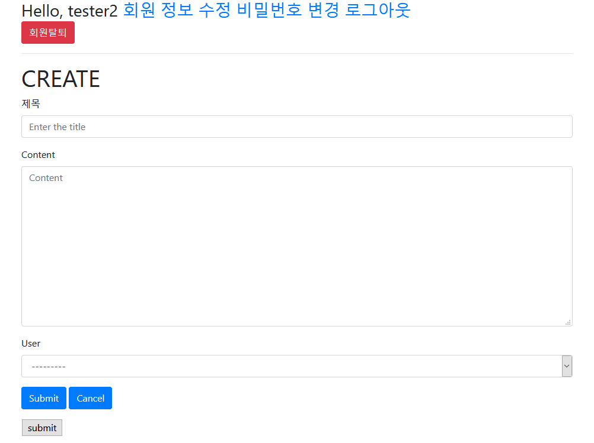
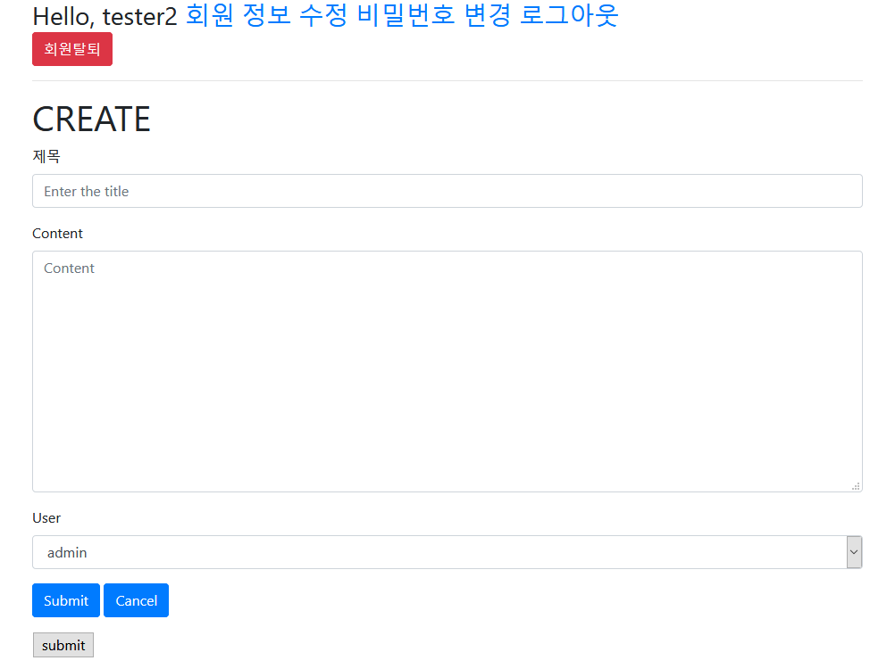

# 회원가입 페이지 만들기


## 0. 프로젝트 가져오기

이전 프로젝트에서 이어서 할건데 내가 수업에 안왔어서;; 강사님 git에서 기존 프로젝트를 가져온다.

```bash
python -m venv venv
activate
pip install -r requirements.txt
python manage.py makemigrations
python manage.py migrate
python manage.py createsuperuser
```

* venv는 git에 없으므로 복사가 안되니까 복사한 폴더 내에 venv 폴더 만들고 가상환경 활성화를 먼저 해준다.
* model migration이랑 관리자 계정 만들기는 따로 해줘야 한다.


## 1. 앱 만들기

`accounts` 라는 앱을 만든다.

```bash
python manage.py startapp accounts
```

프로젝트 폴더인 `myform` 폴더 내의 `settings.py` 수정.

```python
INSTALLED_APPS = [
    'accounts',
    ...
]
```

`myform` > `urls.py` 수정.

```python
urlpatterns = [
    ...
    path('accounts/', include('accounts.urls')),
]
```


## 2. 회원가입 페이지 만들기

`accounts` > `urls.py` 생성.

```python
from django.urls import path
from . import views

app_name = "accounts"

urlpatterns = [
    path('signup/', views.signup, name="signup"),
]
```

`accounts` > `views.py` 에 signup 메소드 추가.

```python
from django.shortcuts import render
from django.contrib.auth.forms import UserCreationForm

# Create your views here.

def signup(request):
    if request.method == "POST":
        pass
    else:
        form = UserCreationForm()
    context = {'form': form}
    return render(request, 'accounts/signup.html', context)
```

`accounts` > `templates` 폴더 생성 > `accounts` 폴더 생성 > `signup.html` 생성.

```html





<h1>회원 가입</h1>
<form action="" method="POST">
    
    
    
</form>


```

`accounts` > `views.py` 수정.

```python
from django.shortcuts import render, redirect
from django.contrib.auth.forms import UserCreationForm

# Create your views here.

def signup(request):
    if request.method == "POST":
        form = UserCreationForm(request.POST)
        if form.is_valid():
            form.save()
            return redirect('articles:index')
    else:
        form = UserCreationForm()
    context = {'form': form}
    return render(request, 'accounts/signup.html', context)
```


# 로그인 페이지 만들기

`accounts` > `views.py` 에 login 메소드 생성.

```python
...
from django.contrib.auth.forms import UserCreationForm, AuthenticationForm

...

def login(request):
    if request.method == "POST":
        pass
    else:
        form = AuthenticationForm()
    context = {'form': form}
    return render(request, 'accounts/login.html', context)
```

`accounts` > `templates` > `accounts` > `login.html` 생성.

```html





<h1>로그인</h1>
<form action="" method="POST">
    
    
    
</form>


```

`accounts` > `urls.py` 수정.

```python
urlpatterns = [
    ...
    path('login/', views.login, name="login"),
]
```

`accounts` > `views.py` 에 login 메소드 수정.

```python
...
from django.contrib.auth import login as auth_login

...

def login(request):
    if request.method == "POST":
        form = AuthenticationForm(request, request.POST)
        if form.is_valid():
            auth_login(request, form.get_user())
            return redirect('articles:index')
    else:
        form = AuthenticationForm()
    context = {'form': form}
    return render(request, 'accounts/login.html', context)
```

* `django.contrib.auth` 에서 `login`을 import 할 때 `auth_login` 이라는 이름으로 import하는 이유는 우리가 직접 만드는 login 메소드와 헷갈리지 않기 위해서이다.

로그인 후에는 목록 페이지에서 로그인한 사용자의 정보(아이디)가 보이게끔 `myform` > `templates` > `base.html` 수정.

```html
...
<body>
    <div class="container">
        <h3>Hello, {{ user.username }}</h3>
        <hr>
        
        
    </div>
    
</body>
</html>
```

* 여기서는 user를 안보내줘도 {{ user.username }}으로 불러올 수 있다 (request에 들어있어서).


# 로그아웃 페이지 만들기

`accounts` > `views.py` 에 logout 메소드 생성.

```python
...
from django.contrib.auth import logout as auth_logout

...

def logout(request):
    auth_logout(request)
    return redirect('articles:index')
```

* `logout`도 마찬가지로 `auth_logout`이라는 이름으로 import해서 우리가 만드는 logout 메소드와 헷갈리지 않도록 한다.

`accounts` > `urls.py` 수정.

```python
urlpatterns = [
    ...
    path('logout/', views.logout, name="logout"),
]
```

`myform` > `templates` > `base.html` 수정.

```html
...
<body>
    <div class="container">
        <h3>
            Hello, {{ user.username }}
            <a href="">로그아웃</a>
        </h3>
        <hr>
        
        
    </div>
    
</body>
</html>
```

그런데 이 경우 로그아웃해도 로그아웃 버튼이 안사라진다.

따라서 아래와 같이 수정한다.

`myform` > `templates` > `base.html`

```html
...
<body>
    <div class="container">
        
            <h3>
                Hello, {{ user.username }}
                <a href="">로그아웃</a>
            </h3>
        
            <h3>
                <a href="">로그인</a>
                <a href="">회원가입</a>
            </h3>
        
        <hr>
        
        
    </div>
    
</body>
</html>
```


# 로그인 한 상태일 때


## 1. 로그인 된 상태에서 또 로그인 페이지에 들어가지는 현상 막기

`accounts` > `views.py` 수정.

```python
...

def signup(request):

    if request.user.is_authenticated:
        return redirect('articles:index')
    
    ...

def login(request):

    if request.user.is_authenticated:
        return redirect('articles:index')

    ...

...
```

* 이렇게 하면 로그인 한 상태에서 로그인 페이지나 회원가입 페이지로 접근했을 때 그냥 인덱스 페이지로 연결된다.


## 2. 회원가입하면 바로 로그인되도록 하기

`accounts` > `views.py` 수정.

```python
...

def signup(request):

    ...
    
    if request.method == "POST":
        form = UserCreationForm(request.POST)
        if form.is_valid():
            user = form.save()
            auth_login(request, user)
            return redirect('articles:index')
    
    ...

...
```

* form을 통해 회원가입 정보를 만들 때 그 정보를 바로 user에 저장해서 로그인 메소드에 보내는 것.


## 3. 로그인 했을 경우에만 글쓰기/수정/삭제 가능하게 하기

`articles` > `templates` > `articles` > `index.html` 수정해서 로그인 했을 때에만 글쓰기 버튼이 보이도록 하기.

```html



    <h1>Articles</h1>
    
        <a href="">[NEW]</a>
    ...

```

`articles` > `views.py` 수정해서 글쓰기/삭제/수정 페이지로 바로 접근하는 것 막기.

```python
...
from django.contrib.auth.decorators import login_required

...

# 이런 식으로도 사용 가능하다! @login_required(login_url="/accounts/test/")
@login_required
def create(request):
    ...

@login_required
@require_POST
def delete(request, article_pk):
    ...

@login_required
def update(request, article_pk):
    ...

...
```


## 4. 로그인 후 바로 메소드 실행되도록 하기

`accounts` > `views.py` 수정.

```python
def login(request):

    ...

    if request.method == "POST":
        form = AuthenticationForm(request, request.POST)
        if form.is_valid():
            auth_login(request, form.get_user())
            return redirect(request.GET.get('next') or 'articles:index')
    
    ...
```

* decorator로 `@login_requred` 를 붙이게 되면, 주소를 통해 그 메소드로 바로 접근하려고 할 때 로그인 페이지로 이동되면서 동시에 쿼리로 next가 생성되면서 내가 원래 접근하려던 페이지가 들어가게 된다.
  * 예를 들어, 로그인을 안한 상태에서 `http://localhost:8000/articles/create/` 로 바로 접근하려고 하면 `http://localhost:8000/accounts/login/?next=/articles/create/` 로 연결되어서, next 쿼리가 생긴다.
* 그래서 위 코드처럼 `request.GET.get('next')` 를 써주게 되면 로그인 후 내가 원래 접근하려던 페이지로 이동된다. 만약 그렇지 않을 경우 or을 통해 index로 이동시켜준다.


# 참고: request를 통해 전달되는 user 정보

`articles` > `views.py`

```python
def index(request):
    embed()
    articles = Article.objects.all()
    context = {'articles': articles}
    return render(request, 'articles/index.html', context)
```

이렇게 `embed()` 를 넣고 `http://localhost:8000/articles/` 에 접속하면 vscode terminal을 통해 ipython을 사용할 수 있게 된다.

```ipython
In [1]: request.user
Out[1]: <django.contrib.auth.models.AnonymousUser at 0x241bbb9e048>

In [2]: dir(request.user)
Out[2]:
['__class__',
 '__delattr__',
 '__dict__',
 '__dir__',
 '__doc__',
 '__eq__',
 '__format__',
 '__ge__',
 '__getattribute__',
 '__gt__',
 '__hash__',
 '__init__',
 '__init_subclass__',
 '__int__',
 '__le__',
 '__lt__',
 '__module__',
 '__ne__',
 '__new__',
 '__reduce__',
 '__reduce_ex__',
 '__repr__',
 '__setattr__',
 '__sizeof__',
 '__str__',
 '__subclasshook__',
 '__weakref__',
 '_groups',
 '_user_permissions',
 'check_password',
 'delete',
 'get_all_permissions',
 'get_group_permissions',
 'get_username',
 'groups',
 'has_module_perms',
 'has_perm',
 'has_perms',
 'id',
 'is_active',
 'is_anonymous',
 'is_authenticated',
 'is_staff',
 'is_superuser',
 'pk',
 'save',
 'set_password',
 'user_permissions',
 'username']

In [3]: request.user.is_anonymous
Out[3]: True

In [4]: request.user.is_authenticated
Out[4]: False

In [5]: request.user.is_superuser
Out[5]: False

In [6]: exit
```

다 끝나면 `embed()` 는 다시 지운다.


# 로그인 한 사용자만 댓글기능을 사용할 수 있게 하기

그냥 `@login_required` 만을 사용할 때의 문제점: 이 경우 로그인이 안 된 상태일 때는 로그인 창으로 보내고 원래 실행하려던 메소드를 next 쿼리로 보내는데, 이 때 next로 실행되는 메소드를 통해 전달되는 정보는 POST가 아닌 GET 방식으로 전달되기 때문에 `@require_POST` 와 상충되어 제대로 실행이 안되게 되고 status code 405의 에러가 발생하게 된다.

따라서 다음과 같이 수정해준다.

`articles` > `views.py`

```python
...
from django.http import HttpResponse

...

# @login_required 삭제
@require_POST
def delete(request, article_pk):
    if request.user.is_authenticated:
        article = get_object_or_404(Article, pk=article_pk)
        article.delete()
        return redirect("articles:index")
    return HttpResponse("You are Unauthorized", status=401)

...

@require_POST
def comments_create(request, article_pk):
    if request.user.is_authenticated:
        article = get_object_or_404(Article, pk=article_pk)
        comment_form = CommentForm(request.POST)
        if comment_form.is_valid():
            comment = comment_form.save(commit=False)
            comment.article = article
            comment.save()
        return redirect("articles:detail", article_pk)
    return HttpResponse("You are Unauthorized", status=401)

@require_POST
def comments_delete(request, article_pk, comment_pk):
    if request.user.is_authenticated:
        comment = get_object_or_404(Comment, pk=comment_pk)
        comment.delete()
        return redirect("articles:detail", article_pk)
    return HttpResponse("You are Unauthorized", status=401)
```

* `.is_authenticated` 를 사용한다.
* 권한이 없을 경우 나타낼 메세지와 상태코드를 위해서 HttpResponse를 사용한다.
* 이렇게 하면 로그인 안한 상태에서 댓글을 작성/삭제하려고 할 경우 "You are Unauthorized" 라는 경고문이 뜨는 페이지로 이동되며, 이때의 상태코드는 401이 된다.
  * status code 401은 권한없음을 의미한다.


# 회원 탈퇴 기능 만들기

`articles` > `views.py` 에 delete 메소드 생성.

```python
...
from django.views.decorators.http import require_POST

...

@require_POST
def delete(request):
    request.user.delete()
    return redirect('articles:index')
```

`articles` > `urls.py` 수정.

```python
urlpatterns = [
    ...
    path('delete/', views.delete, name="delete"),
]
```

`myform` > `templates` > `base.html` 수정.

```html
...
<body>
    <div class="container">
        
            <h3>
                Hello, {{ user.username }}
                <a href="">로그아웃</a>
                <form action="" method="POST">
                    
                    <input type="submit" value="회원탈퇴" class="btn btn-danger">
                </form>
            </h3>
        ...
```


# 회원정보 수정 기능 만들기

CRUD에서 Update 로직과 비슷하다.

## 1. 회원정보 수정 기능 만들기

`accounts` > `views.py` 에서 UserChangeForm 불러오고 update 메소드 생성.

```python
...
from django.contrib.auth.forms import UserCreationForm, AuthenticationForm, UserChangeForm
...

...

def update(request):
    if request.method == "POST":
        pass
    else:
        form = UserChangeForm()
    context = {'form': form}
    return render(request, 'accounts/update.html', context)
```

`accounts` > `urls.py` 수정.

```python
urlpatterns = [
    ...
    path('update/', views.update, name="update"),
]
```

`accounts` > `templates` > `accounts` > `update.html` 생성.

```html





<h1>회원 정보 수정</h1>
<form action="" method="POST">
    
    
    
</form>


```

`myform` > `templates` > `base.html` 수정.

```html
...
<body>
    <div class="container">
        
            <h3>
                Hello, {{ user.username }}
                <a href="">회원 정보 수정</a>
                ...
```

근데 이렇게 하면 일반 사용자가 보면 안되는 것들까지 다 접근할 수 있게 된다.

따라서 회원 정보 수정 form을 편집해보려고 한다.


## 2. 회원정보 수정 form 편집하기

`accounts` > `forms.py` 생성.

```python
from django.contrib.auth.forms import UserChangeForm
from django.contrib.auth import get_user_model

class CustomUserChangeForm(UserChangeForm):
    class Meta:
        model = get_user_model()    # 현재 활성화 된 user model을 리턴한다.
        fields = ('first_name', 'last_name')
```

* `get_user_model` : django에서 현재 활성화 된 user model을 가져와준다.
* 이제 UserChangeForm을 수정하려고 하는데, 해당 form 안에 뭐가 들어있는지 모른다.
  * [django github](https://github.com/django/django/blob/master/django/contrib/auth/models.py) 에서 `class AbstractUser` 부분 참고.
* fields에 내가 보여주고 싶은 정보만 표시한다.

`accounts` > `views.py` 수정.

```python
...
from django.contrib.auth.forms import UserCreationForm, AuthenticationForm    # UserChangeForm 삭제
...
from .forms import CustomUserChangeForm

...

def update(request):
    if request.method == "POST":
        form = CustomUserChangeForm(request.POST, instance=request.user)
        if form.is_valid():
            form.save()
            return redirect('articles:index')
    else:
        form = CustomUserChangeForm(instance=request.user)
    context = {'form': form}
    return render(request, 'accounts/update.html', context)
```

그런데 로그아웃 후에 `http://localhost:8000/accounts/update/` 에 접근하면 에러가 발생한다. 따라서 update 메소드 앞에 `@login_required`를 붙여준다.

`accounts` > `views.py` 수정.

```python
...
from django.contrib.auth.decorators import login_required

...

@login_required
def update(request):
    ...
```


## 3. 비밀번호 변경 기능 만들기

그런데 위의 회원정보 변경 form에서는 비밀번호는 변경할 수 없다.

회원정보 변경 form 맨 밑에 비밀번호 변경과 관련된 안내에서 "이 양식"에 링크되어있는 주소는 다음과 같다: `http://localhost:8000/accounts/password/`

이를 참고해 비밀번호 변경 기능을 만든다.

`accounts` > `views.py` 에 PasswordChangeForm 불러오고 change_password 메소드 생성.

```python
...
from django.contrib.auth.forms import UserCreationForm, AuthenticationForm, PasswordChangeForm
...

...

def change_password(request):
    if request.method == "POST":
        pass
    else:
        form = PasswordChangeForm(request.user)
    context = {'form': form}
    return render(request, 'accounts/change_password.html', context)
```

`accounts` > `urls.py` 수정.

```python
urlpatterns = [
    ...
    path('password/', views.change_password, name="change_password"),
]
```

`accounts` > `templates` > `accounts` > `change_password.html` 생성.

```html





<h1>비밀번호 변경</h1>
<form action="" method="POST">
    
    
    
</form>


```

`myform` > `templates` > `base.html` 수정.

```html
...
<body>
    <div class="container">
        
            <h3>
                Hello, {{ user.username }}
                <a href="">회원 정보 수정</a>
                <a href="">비밀번호 변경</a>
                <a href="">로그아웃</a>
                ...
```

`accounts` > `views.py` 수정.

```python
...

def change_password(request):
    if request.method == "POST":
        # 반드시 user정보(request.user)를 먼저 작성해주세요.
        form = PasswordChangeForm(request.user, request.POST)
        if form.is_valid():
            form.save()
            return redirect('articles:index')
    else:
        form = PasswordChangeForm(request.user)
    context = {'form': form}
    return render(request, 'accounts/change_password.html', context)
```


## 4. 비밀번호 변경 후에도 로그인이 유지되도록 하기

`accounts` > `views.py` 에 update_session_auth_hash 불러오고 change_password 메소드 수정.

```python
...
from django.contrib.auth import update_session_auth_hash

...

@login_required
def change_password(request):
    if request.method == "POST":
        # 반드시 user정보(request.user)를 먼저 작성해주세요.
        form = PasswordChangeForm(request.user, request.POST)
        if form.is_valid():
            form.save()
            # 현재 사용자의 인증 세션이 무효화되는 것을 막고,
            # 세션을 유지한 상태로 비밀번호를 업데이트 시켜준다.
            update_session_auth_hash(request, form.user)
            return redirect('articles:index')
    else:
        form = PasswordChangeForm(request.user)
    context = {'form': form}
    return render(request, 'accounts/change_password.html', context)
```

이렇게 하면 비밀번호 변경 후에도 로그인이 풀리지 않게 된다.


# 회원 관리 form 통합하기

지금까지 `accounts` 앱에서 만든 template 들을 보면 페이지 제목과 submit 버튼에 들어갈 설명만 빼고는 다 똑같다.

그래서 그냥 한개의 템플릿 (`auth_form.html`) 을 만들어서 회원 가입, 로그인, 회원 정보 수정, 비밀번호 변경을 모두 할 수 있도록 하려고 한다.

`accounts` > `templates` > `accounts` > `auth_form.html` 생성.

```html






    <h1>회원 가입</h1>

    <h1>로그인</h1>

    <h1>회원 정보 수정</h1>

    <h1>비밀번호 변경</h1>


<form action="" method="POST">
    
    
    
</form>


```

`accounts` > `views.py` 에서 signup, login, update, change_password 메소드가 연결되는 페이지 수정.

```python
...

def signup(request):
	...
    return render(request, 'accounts/auth_form.html', context)

def login(request):
	...
    return render(request, 'accounts/auth_form.html', context)

...

@login_required
def update(request):
    ...
    return render(request, 'accounts/auth_form.html', context)

@login_required
def change_password(request):
    ...
    return render(request, 'accounts/auth_form.html', context)
```


# User model에 대해

`accounts` 앱을 만들 때 `models.py`에 user model을 설정 안했는데도 자연스럽게 앱을 쓰고 있어서 왜 그런지 궁금해졌다.

강사님께 여쭤보니 프로젝트를 시작할 때 자동으로 `AbstractBaseUser` 라는 모델이 생성된다고 한다 (이 안에 위에 언급된 `AbstractUser` 가 있다).

프로젝트를 만들면 자동으로 만들어지는 이 모델을 사용하고 있는 것이라고 한다 (근데 앱의 `models.py`에 새 모델을 만들어서 새로운 유저 모델을 사용할 수도 있고, 이것도 나중에 배울 것이라고 한다).


# User와 Article 연결하기


## 1. model 수정

User : Article 관계는 1:N.

두 테이블을 연결해준다.

`articles` > `models.py` 수정.

```python
...
from django.conf import settings

# Create your models here.
class Article(models.Model):
    ...
    user = models.ForeignKey(settings.AUTH_USER_MODEL, on_delete=models.CASCADE)
    
    ...

...
```

* `settings.AUTH_USER_MODEL` 은 위에서 사용한 `get_user_model`  처럼 현재 활성화 된 유저 모델을 가져와준다.
  * 근데 `get_user_model` 은 현재 활성화 된 모델을 반환해줄 때 object의 형태로 반환해준다.
  * 반면 `settings.AUTH_USER_MODEL` 은 string으로 반환해준다.

수정된 model을 migrate 해준다.

```bash
python manage.py makemigrations
```

근데 위 코드를 실행하면 다음과 같은 문구가 나타난다.

```bash
$ python manage.py makemigrations
You are trying to add a non-nullable field 'user' to article without a default; we can't do that (the database needs something to populate existing rows).
Please select a fix:
 1) Provide a one-off default now (will be set on all existing rows with a null value for this column)
 2) Quit, and let me add a default in models.py
Select an option:
```

이렇게 뜨는 이유는 user가 ForeignKey이기 때문에 null값이 있으면 안되는데, user 필드를 생성하기 전에 작성된 article들에는 user가 없기 때문에 이걸 어떻게 처리할 것인지 정해달라는 것이다. 그러므로 다음과 같이 설정한다.

```bash
$ python manage.py makemigrations
You are trying to add a non-nullable field 'user' to article without a default; we can't do that (the d
atabase needs something to populate existing rows).
Please select a fix:
 1) Provide a one-off default now (will be set on all existing rows with a null value for this column)
 2) Quit, and let me add a default in models.py
Select an option: 2
(venv)
user@DESKTOP-MN0561E MINGW64 ~/Documents/Multicampus/웹 프로그래밍/django_form (master)
$ python manage.py makemigrations
You are trying to add a non-nullable field 'user' to article without a default; we can't do that (the database needs something to populate existing rows).
Please select a fix:
 1) Provide a one-off default now (will be set on all existing rows with a null value for this column)
 2) Quit, and let me add a default in models.py
Select an option: 1
Please enter the default value now, as valid Python
The datetime and django.utils.timezone modules are available, so you can do e.g. timezone.now
Type 'exit' to exit this prompt
>>> 1
Migrations for 'articles':
  articles\migrations\0003_article_user.py
    - Add field user to article
```

* option에서 1을 넣고 엔터쳐서 option1을 선택하고, 그러면 기존 게시물들(articles)의 user 필드에 어떤 값을 넣을것이냐는 문구가 나오는데 이때 또 1을 넣고 엔터를 쳐서 값 1을 넣어준다.
  * 즉, 이제까지 작성된 게시물들은 1번 user가 작성한 것이 되는 셈이다.

그리고 migrate 해준다.

```bash
python manage.py migrate
```


## 2. 글 작성 시 user 고정

위와 같이 user와 article을 연결만 해둔 상태에서는 글 작성 시 어떤 user의 계정으로 작성할 것인지 선택할 수 있게 된다.

* 예를 들어, tester2 계정으로 글을 쓸때도 이처럼 User 목록이 표시되고,

  

* 다른 계정을 선택할 수 있다.

  

그렇게 되지 않고 글 작성 시 해당 유저의 계정과 글이 연결되도록 다음과 같이 수정한다.

`articles` > `forms.py` 에서 Meta 클래스의 fields 수정.

```python
class ArticleForm(forms.ModelForm):
    title = forms.CharField(
        label="제목",
        max_length=10,
        widget=forms.TextInput(attrs={
            'class': 'title',
            'placeholder': 'Enter the title',
        })
    )

    class Meta:
        model = Article
        fields = ('title', 'content')    # 여기 수정
```

근데 이 상태로 글을 작성해보면 `NOT NULL constraint failed: articles_article.user_id` 라는 에러가 발생한다. 즉, user값이 없는 것이다. 이를 해결하기 위해서 create 메소드를 다음과 같이 수정한다.

`articles` > `views.py` (수정 전)

```python
...

@login_required
def create(request):
    if request.method == "POST":
        # 폼 인스턴스를 생성하고 요청에 의한 데이터로 채운다. (binding)
        form = ArticleForm(request.POST)
        # 폼이 유효한지 체크한다.
        if form.is_valid():
            article = form.save()
            # title = form.cleaned_data.get("title")
            # content = form.cleaned_data.get("content")
            # article = Article(title=title, content=content)
            # article.save()
            return redirect("articles:detail", article.pk)
    ...
```

`articles` > `views.py` 수정. (수정 후)

```python
...

@login_required
def create(request):
    if request.method == "POST":
        # 폼 인스턴스를 생성하고 요청에 의한 데이터로 채운다. (binding)
        form = ArticleForm(request.POST)
        # 폼이 유효한지 체크한다.
        if form.is_valid():
            article = form.save(commit=False)
            # title = form.cleaned_data.get("title")
            # content = form.cleaned_data.get("content")
            # article = Article(title=title, content=content)
            # article.save()
            article.user = request.user
            article.save()
            return redirect("articles:detail", article.pk)
    ...
```

* `.save(commit=False)` 는 자료를 임시로 저장하되 데이터베이스에 반영하는 것을 지연시키는 것이다. 이 경우, form에 있는 내용을 article이라는 변수에 save하되, 데이터베이스에 반영하는 것은 지연한다. 이렇게 하는 이유는 form에 user값이 비어있기 때문이다.
* 그래서 바로 다음에 article의 user필드에 값으로 request.user를 넣고, 그 다음에 article을 save해서 데이터베이스에 넣는다.


## 3. index 페이지에서 글 작성자 보이게 하기

`articles` > `index.html` 수정.

```html
...
    
        <p><strong>작성자: {{ article.user }}</strong></p>
        <P>{{ article.pk }}</P>
        ...
```


## 4. 남의 글을 함부로 삭제/수정할 수 없도록 하기

현재 계정과 글 작성 계정이 동일하지 않은 경우 삭제/수정 버튼이 안보이도록 `articles` > `templates` > `articles` > `detail.html` 수정.

```html
...
    <p>글 수정 시각: {{ article.updated_at|date:"M, j, Y" }}</p>
    
        <a href="">[UPDATE]</a>
        <form action="" method="POST">
            
            <input type="submit" value="삭제">
        </form>
    
    <hr>
    <!-- 댓글 -->
    ...
```

* 페이지 맨 밑에 [BACK] 버튼이랑 같이 있던 [UPDATE] 버튼을 글 삭제 버튼 바로 옆으로 옮겨주고, UPDATE버튼과 삭제 버튼을 if문으로 묶어서 request의 user와 글 작성 user가 같을 때만 보이도록 한다.

주소창으로 직접 접근하는 것도 막을 수 있도록 `articles` > `views.py` 수정.

```python
...

@require_POST
def delete(request, article_pk):
    if request.user.is_authenticated:
        article = get_object_or_404(Article, pk=article_pk)
        if request.user == article.user:    # 여기 추가
            article.delete()
        return redirect("articles:index")
    return HttpResponse("You are Unauthorized", status=401)

@login_required
def update(request, article_pk):
    article = get_object_or_404(Article, pk=article_pk)
    if request.user == article.user:    # 여기 추가
        if request.method == "POST":
            form = ArticleForm(request.POST)
            form = ArticleForm(request.POST, instance=article)
            if form.is_valid():
                form.save()
                # article.title = form.cleaned_data.get("title")
                # article.content = form.cleaned_data.get("content")
                # article.save()
                return redirect("articles:detail", article_pk)
        else:
            form = ArticleForm(instance=article)
    else:
        return redirect('articles:index')    # 글 작성 user가 아니면 index로 보내버리기
    context = {'form': form}
    return render(request, 'articles/create.html', context)

...
```


# User와 Comment 연결하기


## 1. model 수정

User와 Article을 연결할 때와 똑같다.

`articles` > `models.py` 에서 Comment 클래스 수정.

```python
class Comment(models.Model):
    ...
    user = models.ForeignKey(settings.AUTH_USER_MODEL, on_delete=models.CASCADE)

    ...
```

migration 만들기. articles 연결할 때와 마찬가지로 user field가 비어있기 때문에 default 값을 설정해준다.

```bash
$ python manage.py makemigrations
You are trying to add a non-nullable field 'user' to comment without a default; we can't do that (the database needs something to populate existing rows).
Please select a fix:
 1) Provide a one-off default now (will be set on all existing rows with a null value for this column)
 2) Quit, and let me add a default in models.py
Select an option: 1
Please enter the default value now, as valid Python
The datetime and django.utils.timezone modules are available, so you can do e.g. timezone.now
Type 'exit' to exit this prompt
>>> 1
Migrations for 'articles':
  articles\migrations\0004_comment_user.py
    - Add field user to comment
```

그리고 migrate 해준다.

```bash
python manage.py migrate
```


## 2. 댓글 작성 시 user 고정

지금 상태에서 그냥 댓글을 작성하면 `NOT NULL constraint failed: articles_comment.user_id` 라는 에러가 발생한다.

따라서 `articles` > `views.py` 를 다음과 같이 수정.

```python
...

@require_POST
def comments_create(request, article_pk):
    if request.user.is_authenticated:
        article = get_object_or_404(Article, pk=article_pk)
        comment_form = CommentForm(request.POST)
        if comment_form.is_valid():
            comment = comment_form.save(commit=False)
            comment.article = article
            comment.user = request.user    # 여기 추가
            comment.save()
        return redirect("articles:detail", article_pk)
    return HttpResponse("You are Unauthorized", status=401)

...
```


## 3. 남의 댓글을 함부로 삭제할 수 없도록 하기

현재는 로그인 하지 않은 경우 삭제버튼을 누르면 "You are Unauthorized" 라는 메세지가 보이는 페이지로 연결되는데, 로그인을 한 경우에는 남의 댓글도 삭제할 수 있다.

그러므로 댓글 작성자만 댓글을 삭제할 수 있도록 다음과 같이 수정한다.

우선 댓글 작성 계정과 현재 로그인 된 계정이 동일하지 않을 경우 삭제 버튼을 숨기기 위해 `articles` > `templates` > `articles` > `detail.html` 수정.

```html
...
    
        <div>
            댓글 : {{ comment.content }}
            
                <form action="" method="POST">
                    
                    <input type="submit" value="DELETE">
                </form>
            
        </div>
    
    ...
```

그리고 주소창 접근도 막기 위해 `articles` > `views.py` 수정.

```python
...

@require_POST
def comments_delete(request, article_pk, comment_pk):
    if request.user.is_authenticated:
        comment = get_object_or_404(Comment, pk=comment_pk)
        if request.user == comment.user:
            comment.delete()
        return redirect("articles:detail", article_pk)
    return HttpResponse("You are Unauthorized", status=401)
```

* 이 경우 삭제 버튼이 있다고 해도 현재 로그인한 계정과 댓글 쓴 계정이 다를 경우 삭제 버튼을 눌러도 아무 일도 일어나지 않는다 (그냥 다시 해당 detail 페이지로 연결되는 것).